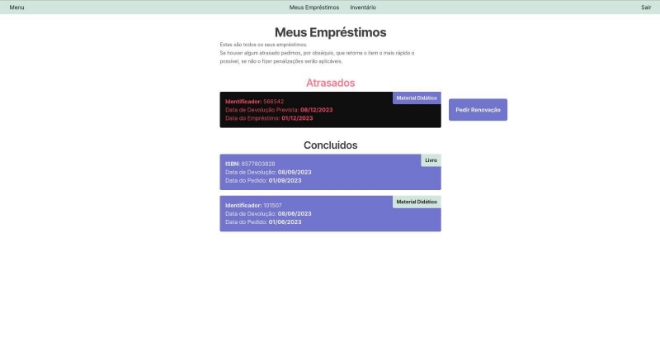
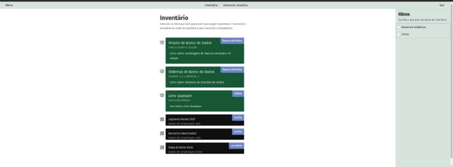
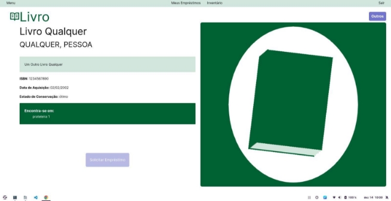
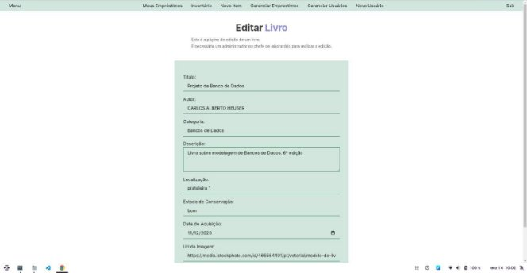
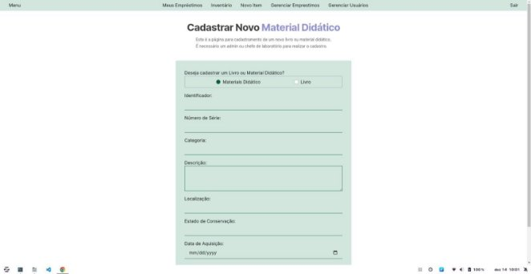
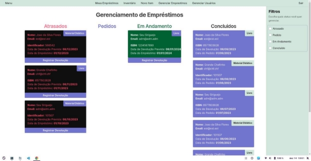
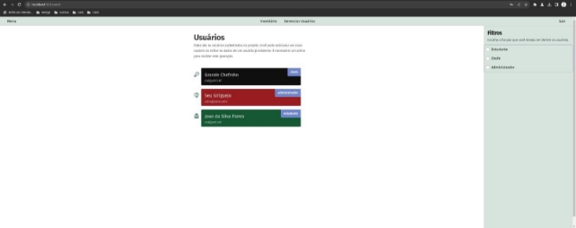
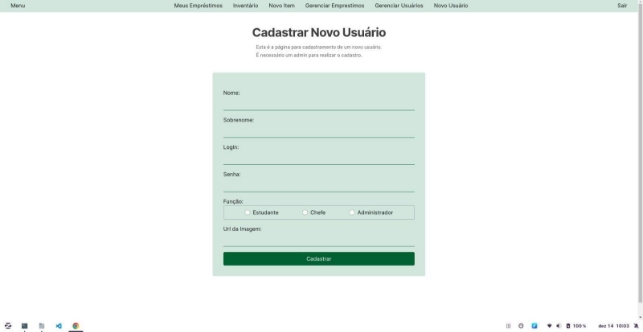
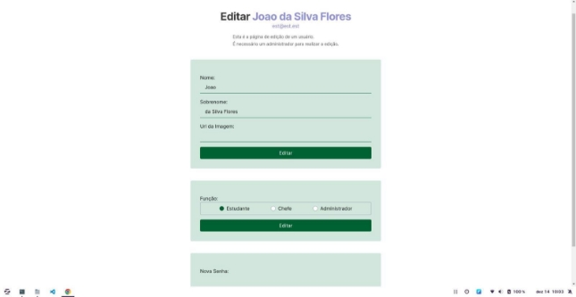
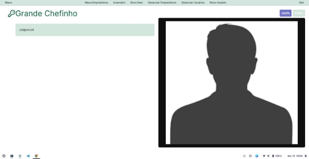

# Manual do Usuário
# Sistema de Gerenciamento de Biblioteca 

## 1. Introdução:

Bem-vindo ao Sistema de Gerenciamento de Biblioteca! Este manual oferecerá  orientações  sobre  como  utilizar  o  sistema  de  forma  eficiente  e segura. 

## 2. Visão Geral do Sistema:

O  Sistema  de  Gerenciamento  de  Biblioteca  foi  desenvolvido  para simplificar o controle de livros, materiais didáticos, usuários e empréstimos em uma biblioteca. Através deste sistema, os usuários e administradores podem realizar diversas tarefas, desde cadastrar novos itens até acompanhar o status de empréstimos. 

## 3. Requisitos do Sistema:

Para utilizar o sistema, certifique-se de que seu dispositivo atenda aos seguintes requisitos:

- Navegador da web atualizado
- Conexão com a Internet
- Docker (Admin) 
- Python (Admin) 

## 4. Registro e Login:
- Registro: Se você é um novo usuário, entre em contato com um administrador para que seja criada uma conta para seu acesso. 

- Login: Após receber os dados de registro, faça login usando seu nome de usuário e senha na página de login; caso seja um administrador, insira as suas credenciais e finalize clicando no Botão “Entrar”. 

## 5. Navegação:
- Barra de Navegação: Utilize a barra de navegação na parte superior para acessar diferentes seções do sistema, como "Meus Empréstimos", “Inventario”, “Novo Item” (Admin), “Gerenciar Empréstimos” (Admin), "Gerenciar Usuários" (Admin/Chefe) além do “Menu” e do botão “Sair” para sair da conta.

## 6. Funcionalidades Principais:
- Filtros: Na lateral direita da tela, pode-se escolher entre “Estudante”, “Chefe" e “Administrador”. 

- Meus Empréstimos: Nesta página se pode verificar os empréstimos que efetuou e as datas de Devolução Prevista e do empréstimo. 

- Inventário: Pode-se selecionar algum item para efetuar a solicitação de empréstimo. 

- Ao selecionar algum material ou livro e verificar sua disponibilidade e informações como a data de aquisição do material ou livro. 

- Editar Livro: Essa página de acesso do administrador ou um chefe permite editar as informações de um livro desejado. 

- Novo Item: Nesta página o administrador pode adicionar um novo Material Didático ou um novo Livro para o sistema. 

- Gerenciamento de Empréstimos: Nesta página o administrador pode visualizar pedidos de empréstimos e suas situações de devolução. 

- Gerenciar Usuários: O administrador pode adicionar algum usuário, editar os dados de um usuário e visualizar os usuários já cadastrados. 

- Cadastrar novo Usuário: Nesta página o administrador pode cadastrar um novo usuário e definir sua função, inserindo o nome, sobrenome, o login e a senha e uma imagem para identificação. 

- Editar Usuário: O administrador tem a possibilidade de editar as informações dos usuários já existentes: 

- Perfil do Usuário: Nesta página o usuário pode visualizar sua foto inserida e informações de login e função. 

## 7. Gestão de Dados:
- Entrada de Dados: O administrador pode adicionar um novo usuário, e pode ser efetuado através do login. 

- Edição e Exclusão: Edite ou exclua itens na seção correspondente.

## 8. Segurança:
- Senhas e Autenticação: Mantenha sua senha segura. 

Evite compartilhar suas credenciais cedidas pelo administrador; se a segurança de suas credenciais for comprometida, entre em contato com um administrador do sistema para solicitar a recuperação das credenciais. 

## 9. Conclusão:

Agradecemos por escolher nosso Sistema de Gerenciamento de Biblioteca. Esperamos que essa ferramenta torne sua experiência mais eficiente, organizada e segura. 
