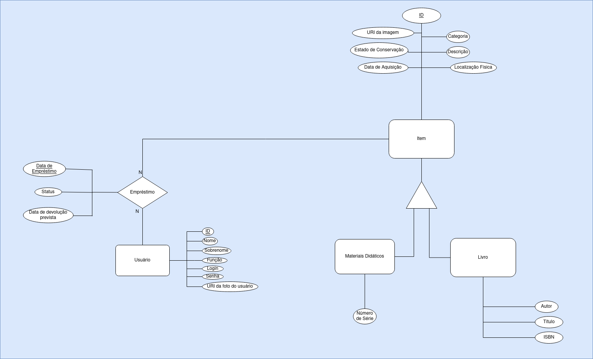

# Diagrama do Modelo Entidade-Relacionamento (MER)

O diagrama foi feito praticamente exatamente conforme as especificações.

Diferenças:

- Foi colocado **Data de Emprestimo** como uma das **chaves primárias** da Entidade **Emprestimos**. Para isso, foram considerados que:
  - Um usuário pode pegar emprestado o mesmo livro em 2 datas diferentes. Portanto não basta que as chaves estrangeiras sejam usadas como _PK_'s;
  - Um usuário não pode pegar um mesmo livro emprestado 2 vezes no mesmo dia;
- **Herança** de Item para Livros e Materiais Didaticos. Isso se deve ao fato de que:
  - Livros e Materiais Didáticos possuem muitos atributos em comum;
  - ambos apresentam o relacionamento de empréstimos;

----
