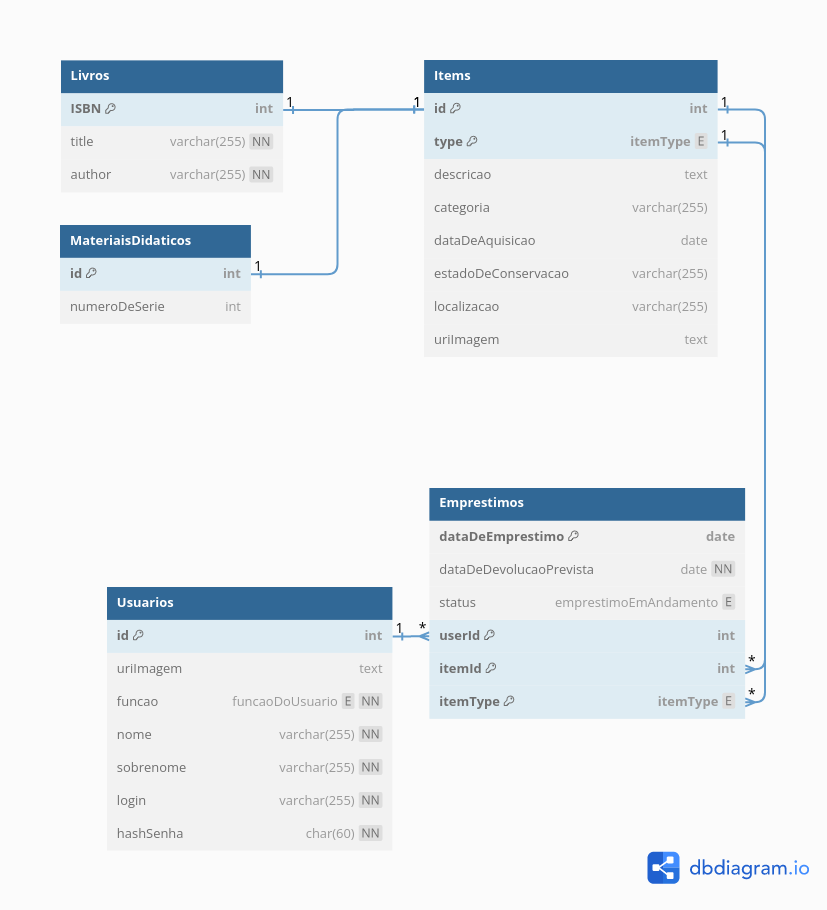

# Diagrama do Modelo Relacional

## O diagrama

A maneira que boa parte das coisas foram convertidas do MER para o Modelo Relacional é clara o suficiente, mas ainda existem alguns pontos a se falar.

Começando pelo **ponto mais interessante**:

## Considerações

### Como implementar uma herança em SQL?

1. **_Single Table Inheritance_**:
   - Criar **uma única tabela** com todas as propriedades **de todas as entidades** na relação de herança, e diferenciar qual a entidade da linha/_row_ com um atributo adicional;
   - Isso cria **problemas**, pois, por exemplo, **não pode** se definir o atributo **ISBN como não nulo**, já que `"Material Didatico"`, **que tem ISBN nulo, ocuparia a mesma tabela** que `"Livro"`. Existem outros problemas, como **dificuldade de diferenciação** dos atributos de cada "filho", etc.
2. **_Concrete Table Inheritance_**:
   - Fazer **uma tabela para cada filho** do relacionamento, colocando os atributos do parente em cada um dos filhos. Ou seja, a herança definida com `"Item"`, `"Livro"` e `"Material Didatico"` seria implementado usando uma tabela para `"Livro"` e uma para `"Material Didatico"`;
   - Isso cria **problemas**, pois, por exemplo, teríamos não uma, mas **duas tabelas** que possuem com **lógica de negócio semelhantes** (o que significa código duplicado), e a partir daí **mais duas tabelas** de `"Emprestimo"` diferentes, **multiplicando o problema** por 2. Manutenção e alteração das tabelas está mais suscetível a erro humano, pois coisas que **estão** muito **próximas** entre si **na modelagem** estão sendo **implementados** mais **distantes**. Busca pelos itens independente do tipo fica mais difícil, e necessitaria de `UNION`'s.
3. **_Class Table Inheritance_**:
   - Fazer uma **tabela com os atributos comuns** entre os filhos (representando o pai). Então implementar **cada filho** como sua própria **tabela**, a qual tem **chave primária** que **também** funciona como **chave estrangeira** para seu **pai**;
   - Um **problema** conhecido dessa implementação é a dificuldade em **encontrar os filhos** a partir **do pai**. **Geralmente** é necessário **procurar em tabela por tabela** dos filhos. No entanto, utilizar o atributo **type** no **pai** é o suficiente para diferenciar em **qual tabela procurar**.

**Finalmente**, com todas essas considerações, e visto que não foram feitas todas as considerações possíveis, somente as pensadas mais relevantes para o problema, foi decidido que **a melhor opção é** usar **_Class Table Inheritance_**.

### Outros Detalhes de Implementação

- **Foram criados tipos Enum** para os campos `"Emprestimos"."status"`, `"Usuarios"."funcao"`, `"Items"."type"`, pois
  - Isso torna o banco de dados uma fonte de verdade mais abrangente, contendo segurança de tipos ao inserir valores nesses campos;

 

- Sobre `"Emprestimos"`, além de usar `(itemId, itemType, userId, dataDeEmprestimo)` como _PK_, também será usado um **index único** para `(status, )`

 

- O **hash da senha é** guardada como **`char(60)`**, pois
  - A função de criptografia sempre gera um hash de mesmo tamanho;
  - Em específico, usar [crypto do pgcrypto](https://www.postgresql.org/docs/current/pgcrypto.html#PGCRYPTO-PASSWORD-HASHING-FUNCS) com o algoritmo `bf` gera output de tamanho `60`;
